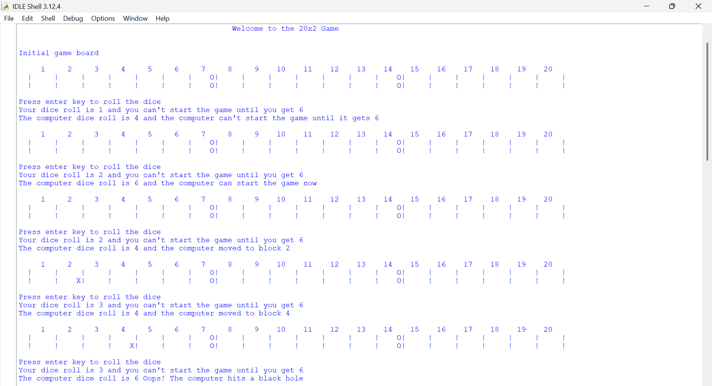
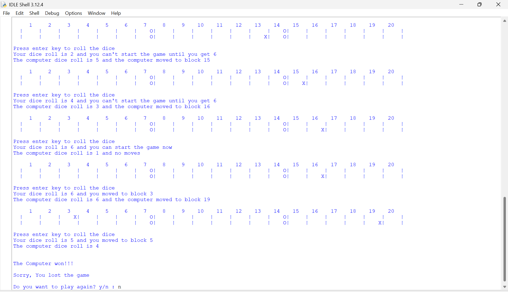

# Python-Dice-Roll-Game
20x2 Board Game - A Python text-based board game where players race against the computer on a 20×2 board, avoiding black holes and strategically advancing to reach position 20 first. Features game state tracking, timestamped records, and an interactive console interface. A text-based board game written in Python where a player competes against the computer on a 20x2 game board.

## Game Description

The 20x2 board game is played between a human player and a computer on a game board consisting of 20 blocks in 2 rows. Players roll a dice to determine movement, where the number of steps is half the dice value (floor division). Players must roll a 6 to enter the board initially.

The board contains two black holes at positions 7 and 14, represented by 'O'. If a player lands on a black hole, they return to block 1. Players are represented by 'X' on the board.

The first player to reach or pass the 20th block wins the game.

## Features

- Text-based interface with clear board visualization
- Random dice rolls using Python's random module
- Automatic game record saving to a timestamped text file
- Option to play again after game completion
- Black hole obstacles that add strategic elements

## Files

- `Main Program.py` - The entry point of the game
- `dice_roll.py` - Contains the main game logic and board rendering
- `text_file.py` - Handles game record saving to text files

## How to Play

1. Run the `Main Program.py` file:
   ```
   python "Main Program.py"
   ```

2. The initial game board will be displayed.

3. Press Enter to roll the dice.

4. The first roll must be a 6 to enter the board.

5. Movement is calculated as dice roll ÷ 2 (floor division).
   - Example: Rolling a 6 moves you 3 blocks
   - Rolling a 1 results in no movement

6. Avoid black holes at positions 7 and 14.

7. First player to reach or pass position 20 wins.

8. Game results are saved to a text file named with the current timestamp.

9. After the game ends, you can choose to play again.

## Game Rules Summary

- Players take turns rolling the dice
- Must roll a 6 to start
- Movement = dice roll ÷ 2 (floor division)
- Land on a black hole (positions 7 & 14) → return to position 1
- First to reach or pass position 20 wins

## Game Record

After each game, a record is saved in a text file with the format `YYYY_MM_DD_HH_MM.txt` containing:
- Total moves for each player
- Number of black hole hits
- Game result (win/loss)

## Screenshots

### Gameplay and Board Visualization

*Initial game board and dice rolling mechanics*


*Game progression with computer winning the game*



### Game Features Shown in Screenshots:
- Board visualization with positions 1-20
- Black holes at positions 7 and 14 (marked with 'O')
- Player and computer positions (marked with 'X')
- Dice roll outcomes and movement calculation
- Black hole hit notification
- Game win/loss announcement
- Play again prompt

## Requirements

- Python 3.x
